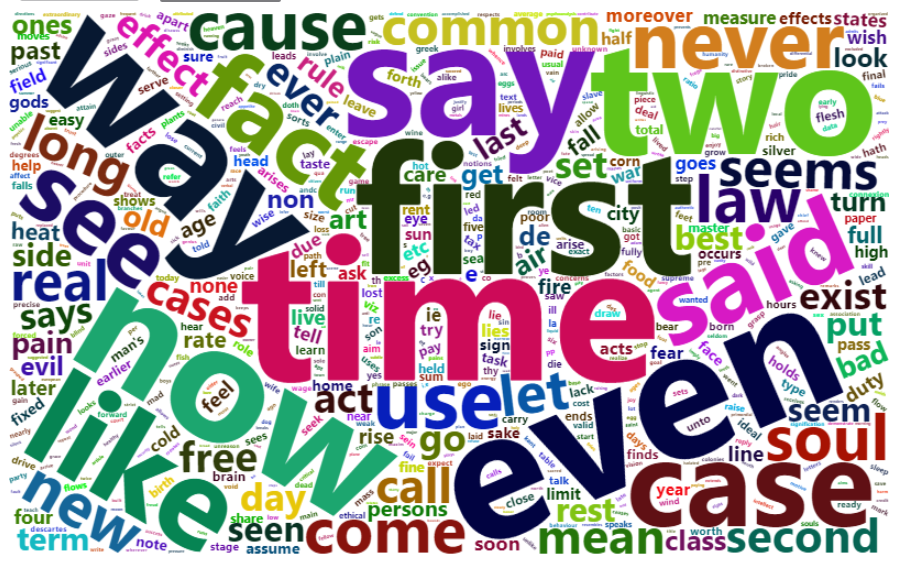
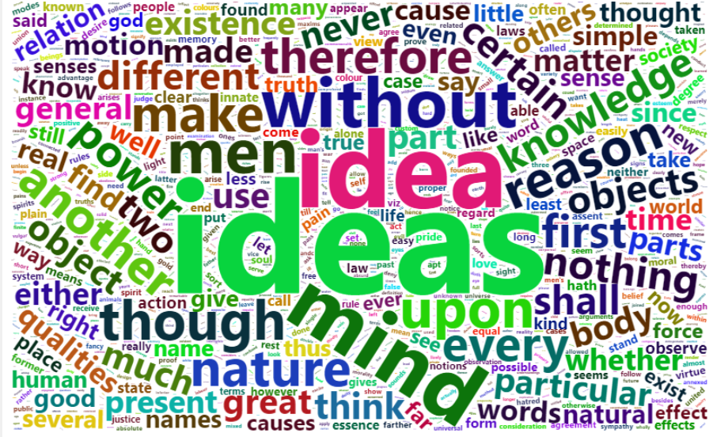
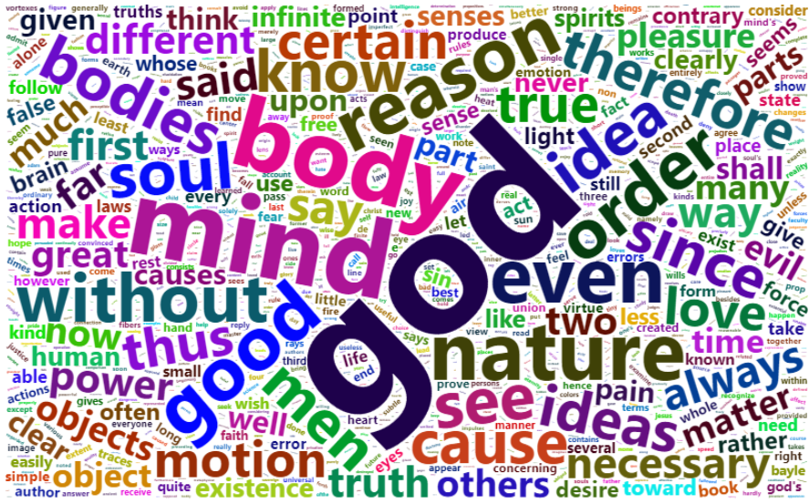
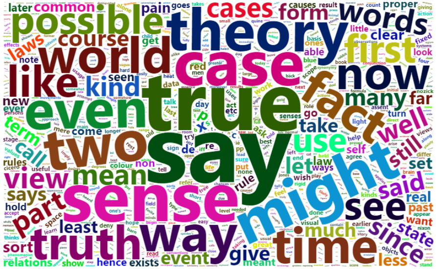
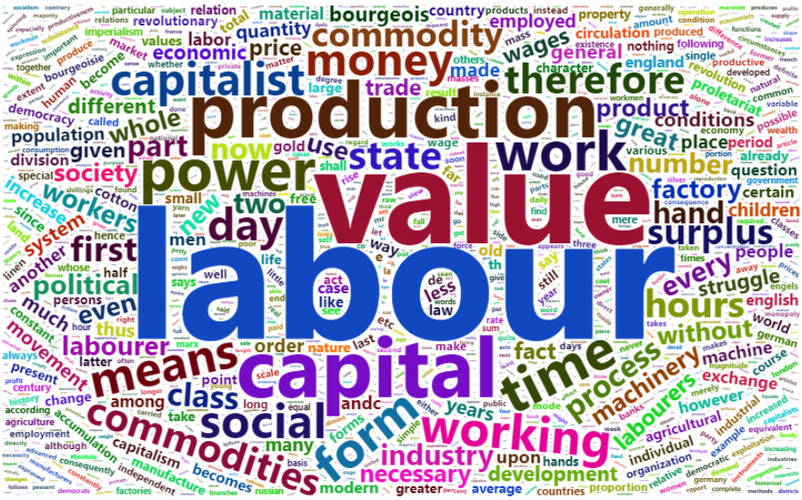

```{r,results="hide"}
library(tidyverse)
library(tm)
library(tidytext)
library(wordcloud2)
library(ggplot2)
data=read_csv("../data/philosophy_data.csv")

```


```{r}
hist(data$sentence_length,breaks = 200,xlab = "Length",main = "Histogram of length")
hist(data$sentence_length[which(data$sentence_length<600)],breaks = 200,xlab = "Length",main = "Histogram of length (<600)")
sum(data$sentence_length>600)/nrow(data)
median(data$sentence_length)
```


```{r}
(g1= ggplot(data,aes(school,sentence_length,fill=school))+
  geom_violin())
```


```{r}
rus_stopwords = data.frame(word = stopwords("en"))
rus_stopwords=rbind(rus_stopwords,"one","will","can","must","things","also","may","thing","just","us","yet","else","man")

all_tokens=data%>%select(sentence_str)%>%
  unnest_tokens(word, sentence_str)%>% anti_join(rus_stopwords)
all_frequency = all_tokens %>% count(word) %>% arrange(desc(n))
### wordcloud2(all_frequency)

```



```{r}
plato_tokens=data%>%filter(school=="plato")%>%select(sentence_str)%>%
  unnest_tokens(word, sentence_str)%>% anti_join(rus_stopwords)
plato_frequency = plato_tokens %>% count(word) %>% arrange(desc(n))
### wordcloud2(plato_frequency)
```   


```{r}
aristotle_tokens=data%>%filter(school=="aristotle")%>%select(sentence_str)%>%
  unnest_tokens(word, sentence_str)%>% anti_join(rus_stopwords)
aristotle_frequency = aristotle_tokens %>% count(word) %>% arrange(desc(n))
### wordcloud2(aristotle_frequency)
```


```{r}
empiricism_tokens=data%>%filter(school=="empiricism")%>%select(sentence_str)%>%
  unnest_tokens(word, sentence_str)%>% anti_join(rus_stopwords)
empiricism_frequency = empiricism_tokens %>% count(word) %>% arrange(desc(n))
### wordcloud2(empiricism_frequency)
```



```{r}
rationalism_tokens=data%>%filter(school=="rationalism")%>%select(sentence_str)%>%
  unnest_tokens(word, sentence_str)%>% anti_join(rus_stopwords)
rationalism_frequency = rationalism_tokens %>% count(word) %>% arrange(desc(n))
### wordcloud2(rationalism_frequency)
```



```{r}
analytic_tokens=data%>%filter(school=="analytic")%>%select(sentence_str)%>%
  unnest_tokens(word, sentence_str)%>% anti_join(rus_stopwords)
analytic_frequency = analytic_tokens %>% count(word) %>% arrange(desc(n))
### wordcloud2(analytic_frequency)
```



```{r}
continental_tokens=data%>%filter(school=="continental")%>%select(sentence_str)%>%
  unnest_tokens(word, sentence_str)%>% anti_join(rus_stopwords)
continental_frequency = continental_tokens %>% count(word) %>% arrange(desc(n))
### wordcloud2(continental_frequency)
```


```{r}
phenomenology_tokens=data%>%filter(school=="phenomenology")%>%select(sentence_str)%>%
  unnest_tokens(word, sentence_str)%>% anti_join(rus_stopwords)
phenomenology_frequency = phenomenology_tokens %>% count(word) %>% arrange(desc(n))
### wordcloud2(phenomenology_frequency)
```


```{r}
german_idealism_tokens=data%>%filter(school=="german_idealism")%>%select(sentence_str)%>%
  unnest_tokens(word, sentence_str)%>% anti_join(rus_stopwords)
german_idealism_frequency = german_idealism_tokens %>% count(word) %>% arrange(desc(n))
### wordcloud2(german_idealism_frequency)
```


```{r}
communism_tokens=data%>%filter(school=="communism")%>%select(sentence_str)%>%
  unnest_tokens(word, sentence_str)%>% anti_join(rus_stopwords)
communism_frequency = communism_tokens %>% count(word) %>% arrange(desc(n))
### wordcloud2(communism_frequency)
```



```{r}
capitalism_tokens=data%>%filter(school=="capitalism")%>%select(sentence_str)%>%
  unnest_tokens(word, sentence_str)%>% anti_join(rus_stopwords)
capitalism_frequency = capitalism_tokens %>% count(word) %>% arrange(desc(n))
### wordcloud2(capitalism_frequency)
```


```{r}
stoicism_tokens=data%>%filter(school=="stoicism")%>%select(sentence_str)%>%
  unnest_tokens(word, sentence_str)%>% anti_join(rus_stopwords)
stoicism_frequency = stoicism_tokens %>% count(word) %>% arrange(desc(n))
### wordcloud2(stoicism_frequency)
```


```{r}
nietzsche_tokens=data%>%filter(school=="nietzsche")%>%select(sentence_str)%>%
  unnest_tokens(word, sentence_str)%>% anti_join(rus_stopwords)
nietzsche_frequency = nietzsche_tokens %>% count(word) %>% arrange(desc(n))
### wordcloud2(nietzsche_frequency)
```


 
 
```{r}
feminism_tokens=data%>%filter(school=="feminism")%>%select(sentence_str)%>%
  unnest_tokens(word, sentence_str)%>% anti_join(rus_stopwords)
feminism_frequency = feminism_tokens %>% count(word) %>% arrange(desc(n))
### wordcloud2(feminism_frequency)
feminism_frequency%>%filter(word=="women"|word=="woman")%>%select(word,feminism=n)%>%mutate(
all_frequency%>%filter(word=="women"|word=="woman")%>%select(all=n))
count(data,school=="feminism")
```


