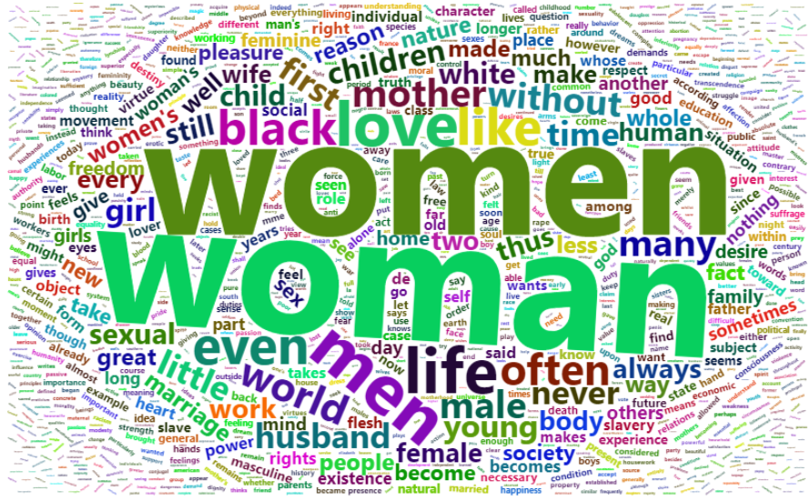

# Part 1 Introduction

We became interested in the differences between schools in the history of philosophy. From a dataset that contains over 300,000 sentences from over 50 texts spanning 10 major schools of philosophy I want to talk a data story about the direct differences and relationships between these schools. The represented schools are: Plato, Aristotle, Rationalism, Empiricism, German Idealism, Communism, Capitalism, Phenomenology, Continental Philosophy, and Analytic Philosophy. What we are looking at is the date of publication, the length, and the frequency of the words. Now we first load some packages and read the dataset.

```{r,results="hide"}
library(tidyverse)
library(tm)
library(tidytext)
library(wordcloud2)
library(ggplot2)
data=read_csv("../data/philosophy_data.csv")
```

# Part 2 Length of Sentence

```{r}
hist(data$sentence_length,breaks = 200,xlab = "Length",main = "Histogram of length")
```

After importing the data, we first look at the letter length of each sentence. When we plot the histogram, we can see that the longest sentence is made up of more than 2,000 letters, but most sentences are not that long, basically less than 600 letters.

```{r}
hist(data$sentence_length[which(data$sentence_length<600)],breaks = 200,xlab = "Length",main = "Histogram of length (<600)")
sum(data$sentence_length>600)/nrow(data)
median(data$sentence_length)
```

For convenience, let's redraw the histogram of the sentences with less than 600 letters. By calculation, only 0.4% of the sentences were longer than 600 letters. The median number of letters is 127. The histogram shows that the frequency increases as the length increases, and then decreases gradually after reaching the peak. And it also shows a distribution skewed to the right.


```{r}
(g1= ggplot(data,aes(school,sentence_length,fill=school))+
  geom_violin())
```

Next we draw some violin plots of each school and see what their characteristics are. Except for nietzsche and plato, the plots of other schools are like water droplets. The plots of nietzsche and plato look like triangles, which means many of these sentences are short sentences.

# Part 3 Frequency of Words

```{r}
rus_stopwords = data.frame(word = stopwords("en"))
rus_stopwords=rbind(rus_stopwords,"one","will","can","must","things","also","may","thing","just","us","yet","else","man")
```

First we set same Particularly common words, like pronouns or conjunctions. We will not count these words when we do word frequency statistics.

## All
```{r}
all_tokens=data%>%select(sentence_str)%>%
  unnest_tokens(word, sentence_str)%>% anti_join(rus_stopwords)
all_frequency = all_tokens %>% count(word) %>% arrange(desc(n))
### wordcloud2(all_frequency)
```


After counting the frequency of words, we draw the wordcloud for all philosophy sentences.

## Plato
```{r}
plato_tokens=data%>%filter(school=="plato")%>%select(sentence_str)%>%
  unnest_tokens(word, sentence_str)%>% anti_join(rus_stopwords)
plato_frequency = plato_tokens %>% count(word) %>% arrange(desc(n))
### wordcloud2(plato_frequency)
```   


From the wordcloud of Plato school, we can see that "say", "said" and "think" are come up a lot. we can get that many of these sentences are quotations from some people. As we suspected, Platonism was originally expressed in the dialogues of Plato.

## Aristotle

```{r}
aristotle_tokens=data%>%filter(school=="aristotle")%>%select(sentence_str)%>%
  unnest_tokens(word, sentence_str)%>% anti_join(rus_stopwords)
aristotle_frequency = aristotle_tokens %>% count(word) %>% arrange(desc(n))
### wordcloud2(aristotle_frequency)
```


It is interesting that the word "animals" often appears in Aristotle's sentences. Although Aristotle was a student of Plato, he abandoned the idealistic view held by his teacher. Plato believed that idea is the prototype of material object, which exists independently without relying on material object. Most of the sentences with "animals" described the habits of the animals he had observed, which also reflected his pursuit of science.

## Empiricism

```{r}
empiricism_tokens=data%>%filter(school=="empiricism")%>%select(sentence_str)%>%
  unnest_tokens(word, sentence_str)%>% anti_join(rus_stopwords)
empiricism_frequency = empiricism_tokens %>% count(word) %>% arrange(desc(n))
### wordcloud2(empiricism_frequency)
```


From the wordcloud of Empiricism,"idea", "ideas", and "mind" are the most common words in these sentences. Empiricism holds that perceptual experience is the only source of knowledge, and all knowledge is obtained and verified through experience. This also shows that empiricism has a great deal of discussion on human thought.

## Rationalism

```{r}
rationalism_tokens=data%>%filter(school=="rationalism")%>%select(sentence_str)%>%
  unnest_tokens(word, sentence_str)%>% anti_join(rus_stopwords)
rationalism_frequency = rationalism_tokens %>% count(word) %>% arrange(desc(n))
### wordcloud2(rationalism_frequency)
```


Rationalism is opposed to empiricism, and it believe that criterion of the truth is not sensory but intellectual and deductive. And it is easy to understand discussions of God and ideas fill these sentences.

## Analytic

```{r}
analytic_tokens=data%>%filter(school=="analytic")%>%select(sentence_str)%>%
  unnest_tokens(word, sentence_str)%>% anti_join(rus_stopwords)
analytic_frequency = analytic_tokens %>% count(word) %>% arrange(desc(n))
### wordcloud2(analytic_frequency)
```


Analytic philosophy tends to use logic. The words like "true", "theory" and "fact" are used frequently.


## Continental

```{r}
continental_tokens=data%>%filter(school=="continental")%>%select(sentence_str)%>%
  unnest_tokens(word, sentence_str)%>% anti_join(rus_stopwords)
continental_frequency = continental_tokens %>% count(word) %>% arrange(desc(n))
### wordcloud2(continental_frequency)
```


From the wordcloud, we can see that "madness" and "language" appear most frequently. 

## Phenomenology 
```{r}
phenomenology_tokens=data%>%filter(school=="phenomenology")%>%select(sentence_str)%>%
  unnest_tokens(word, sentence_str)%>% anti_join(rus_stopwords)
phenomenology_frequency = phenomenology_tokens %>% count(word) %>% arrange(desc(n))
### wordcloud2(phenomenology_frequency)
```


The "world" is the most important word in Phenomenology.

## German Idealism
```{r}
german_idealism_tokens=data%>%filter(school=="german_idealism")%>%select(sentence_str)%>%
  unnest_tokens(word, sentence_str)%>% anti_join(rus_stopwords)
german_idealism_frequency = german_idealism_tokens %>% count(word) %>% arrange(desc(n))
### wordcloud2(german_idealism_frequency)
```


Idealism tends to discuss the relationship between human consciousness and the nature. Therefore, words like "concept", "nature" and "pure" are used frequently.

## Communism
```{r}
communism_tokens=data%>%filter(school=="communism")%>%select(sentence_str)%>%
  unnest_tokens(word, sentence_str)%>% anti_join(rus_stopwords)
communism_frequency = communism_tokens %>% count(word) %>% arrange(desc(n))
### wordcloud2(communism_frequency)
```


Communism hopes to liberate the labor force and give them more value created by themselves. Therefore, "labour" would be the hot word absolutely. Of course, there are many words about labour in sentences, such as "working", "value" and "production".

   

## Capitalism
```{r}
capitalism_tokens=data%>%filter(school=="capitalism")%>%select(sentence_str)%>%
  unnest_tokens(word, sentence_str)%>% anti_join(rus_stopwords)
capitalism_frequency = capitalism_tokens %>% count(word) %>% arrange(desc(n))
### wordcloud2(capitalism_frequency)
```


Capitalism and communism are two opposing concepts. But they do discuss two sides of the one thing, so some words are often mentioned by both sides, such as "labour", but capitalism prefers to replace "value" with "money" and "price".


## Stoicism
```{r}
stoicism_tokens=data%>%filter(school=="stoicism")%>%select(sentence_str)%>%
  unnest_tokens(word, sentence_str)%>% anti_join(rus_stopwords)
stoicism_frequency = stoicism_tokens %>% count(word) %>% arrange(desc(n))
### wordcloud2(stoicism_frequency)
```


## Nietzsche
```{r}
nietzsche_tokens=data%>%filter(school=="nietzsche")%>%select(sentence_str)%>%
  unnest_tokens(word, sentence_str)%>% anti_join(rus_stopwords)
nietzsche_frequency = nietzsche_tokens %>% count(word) %>% arrange(desc(n))
### wordcloud2(nietzsche_frequency)
```


 
The main difference between stoicism and Nietzsche and other schools is that they use a lot of Old English, such as "thou","ye", "thee", and "thy".
 
## Feminism
```{r}
feminism_tokens=data%>%filter(school=="feminism")%>%select(sentence_str)%>%
  unnest_tokens(word, sentence_str)%>% anti_join(rus_stopwords)
feminism_frequency = feminism_tokens %>% count(word) %>% arrange(desc(n))
### wordcloud2(feminism_frequency)
```



As the name suggests, feminism must mention "women", "woman" most. 

```{r}
feminism_frequency%>%filter(word=="women"|word=="woman")%>%select(word,feminism=n)%>%mutate(
all_frequency%>%filter(word=="women"|word=="woman")%>%select(all=n))
count(data,school=="feminism")

```

Let's look at the number of women in other schools. Hundreds of years ago, there was serious gender discrimination, and women had not been paid attention to. Therefore, the word "man" is unconsciously regarded as a personal pronoun, while the words "woman" and "women" are rarely mentioned. From the output we can see that feminism's sentences account for 5% of all sentences, but the number of references to women does account for nearly 80%. So we need to pay more attention to gender equality.

# Part 4 Conclusion

By analyzing the length and frequency of words, we can conclude that the sentences of each school have their own characteristics. By understanding these characteristics, we can also have a deeper understanding of the history of philosophy. On the contrary, we can also infer from the sentence which school it comes from.

